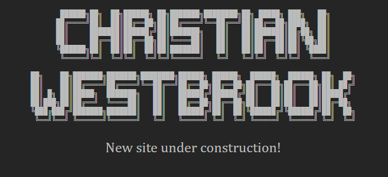

This repository contains the source code for [christianwestbrook.dev](https://www.christianwestbrook.dev/), my personal blog site!

## Usage

Build and run this project with Docker:

`docker image build --tag christianwestbrook.dev:local .`  
`docker container run --detach --rm --publish 80:80 christianwestbrook.dev:local`  

You'll find the project running at `http://localhost:80`

## Project Structure

### Folders

| Folder | Purpose |
|--------|---------|
| docs/ | Architectural model as code using Structurizr: https://structurizr.com/ |
| infra | Git hooks for automated CI/CD and nginx configuration files for serving web content from inside an application container |
| public/ | Created by the build process to store output files ready to be served by a web server |
| src/ | Source files used to build the site |

### Files

| Filename | Purpose |
|----------|---------|
| `.dockerignore` | Tells Docker which files to ignore when copying files into an application container |
| `.gitignore` | Tells Git which files to ignore when tracking development |
| `Dockerfile` | Configures an application container using Docker: https://www.docker.com/ |
| `Jenkinsfile` | Configures a continuous integration and delivery pipeline using Jenkins: https://www.jenkins.io/ |
| `LICENSE` | Specifies how others may legally use this software |
| `Makefile` | Defines the build process using GNU Make: https://www.gnu.org/software/make/ |
| `README.md` | Documents the project structure |

## Contributing

Get started by reading [CONTRIBUTING.md](./CONTRIBUTING.md) and then look for any open [issues](https://github.com/christian-westbrook/christianwestbrook.dev/issues).
